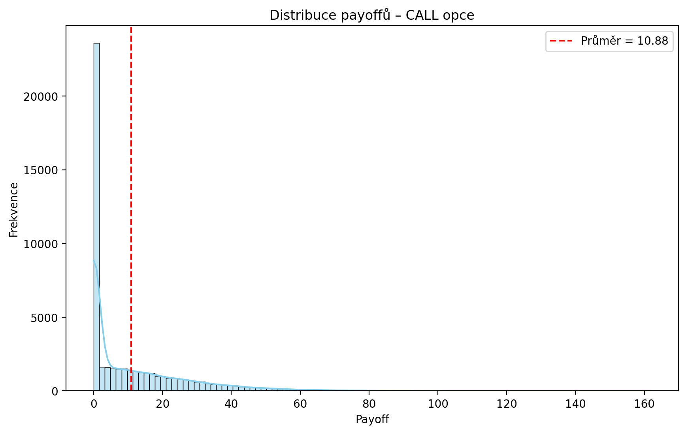
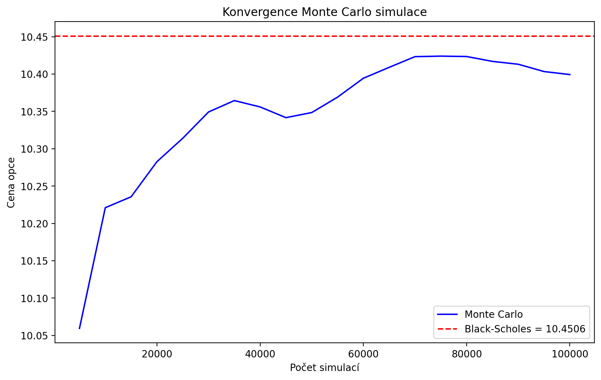
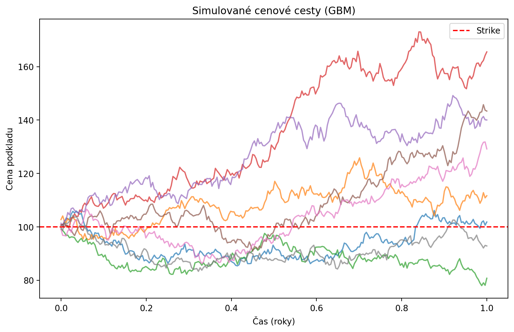
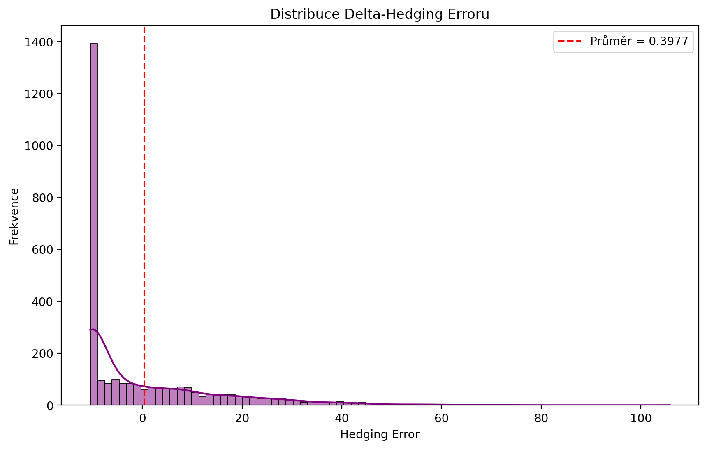

# Option Pricing Engine

**Complete Python tool for pricing European options**  
(Black-Scholes • Monte Carlo • Binomial Tree • Greeks • Delta Hedging)


**Author:** Lukáš Kolík

---

## ✨ Features

- Analytical **Black-Scholes** solution
- **Monte Carlo** simulation (Geometric Brownian Motion, 100 000+ paths)
- **Binomial Tree** (Cox-Ross-Rubinstein model)
- Full **Greeks** calculation (Delta, Gamma, Vega, Theta, Rho)
- **Delta-Hedging** simulation with error analysis
- High-quality visualizations using Matplotlib + Seaborn
- Professional **PDF report** generation with one command
- Automatic export of all charts as PNG files

---

## 📊 Output Examples

**Payoff Distribution**



**Monte Carlo Convergence**



**Simulated Price Paths**



**Delta-Hedging Error Distribution**



---

## 🚀 Quick Start


### Clone the repository
```
git clone https://github.com/tvuj-username/option-pricing-engine.git
cd option-pricing-engine
```

### Install dependencies
```python
pip install -r requirements.txt
```

## Usage Example
```python
from option_pricing_engine import OptionPricingEngine
```

### Create an option (ATM Call example)
```python
engine = OptionPricingEngine(
    S0=100.0,      # Current underlying price
    K=100.0,       # Strike price
    T=1.0,         # Time to expiration in years
    r=0.05,        # Risk-free rate
    sigma=0.20,    # Volatility
    option_type="call"
)

print(f"Black-Scholes price: {engine.black_scholes_price():.4f}")

### Generate PDF report + charts
engine.export_to_pdf()
```

## Project Structure
 
```bash
option-pricing-engine/
├── option_pricing_engine.py          # Main class with all functionality
├── requirements.txt                  # Required packages
├── README.md                         # This documentation
│
├── payoff_distribution.png           # Payoff distribution chart
├── mc_convergence.png                # Monte Carlo convergence chart
├── price_paths.png                   # Simulated price paths
├── delta_hedging_error.png           # Delta-hedging error chart
└── option_report_YYYYMMDD_HHMMSS.pdf # Generated PDF report
```


# 


------------------

# Option Pricing Engine

**Komplexní nástroj pro oceňování evropských opcí v Pythonu**

Implementace tří hlavních metod oceňování opcí + výpočet Greeks,
simulace delta-hedgingu a profesionální PDF report s grafy.

**Autor:** Lukáš Kolík

---

## ✨ Hlavní funkce

- **Black-Scholes** – analytické řešení
- **Monte Carlo simulace** (Geometric Brownian Motion, 100 000+ cest)
- **Binomial Tree** (Cox-Ross-Rubinstein model)
- Výpočet **Greeks** (Delta, Gamma, Vega, Theta, Rho)
- Základní simulace **delta-hedgingu**
- Generování profesionálního **PDF reportu** včetně grafů
- Automatický export grafů jako PNG soubory
- Interaktivní zadání parametrů při spuštění

## 📊 Vytvářené výstupy
- `option_report_YYYYMMDD_HHMMSS.pdf` (kompletní report)
- 4 grafy ve formátu PNG:
**Distribuce payoffů**

**Konvergence Monte Carlo simulace**

**Simulované cenové cesty podkladového aktiva**

**Distribuce chyb Delta-Hedgingu**


---

## 🛠 Technologie

- Python 3.10+
- NumPy, SciPy, Matplotlib, Seaborn
- fpdf2 (PDF generování)

---

## 🚀 Jak spustit


### 1. Naklonuj repozitář
```bash
git clone https://github.com/koldasquare/option-pricing-engine.git
cd option-pricing-engine
```
### 2. Nainstaluj závislosti
```python
pip install -r requirements.txt
```
### 3. Spusť program
```bash
python option_pricing_engine.py
```

Při spuštění můžeš buď použít výchozí parametry,
nebo zadat vlastní hodnoty (S0, K, T, r, sigma, call/put).

### Příklad výstupu (výchozí parametry)
```bash
Podkladová cena (S0): 100
Strike (K): 100
Doba do expirace: 1 rok
Volatilita: 20 %
Bezriziková sazba: 5 %

Výsledné ceny:Black-Scholes ≈ 10.45
Monte Carlo ≈ 10.4x
Binomial Tree ≈ 10.4x
```

## Praktické využití

Tento nástroj je vhodný pro:
- Lepší porozumění derivátům a kvantitativním metodám
- Rychlé testování různých scénářů oceňování opcí
- Ukázku programovacích a analytických schopností v oblasti financí / energetického tradingu.

Autor: Ing. Lukáš Kolík
```python
LinkedIn: https://www.linkedin.com/in/lukaskolik/
Email: lukaskolik@gmail.com
```

Licence: MIT


## Poznámka

Projekt je stále ve vývoji.

 V plánu je další vylepšení simulace delta-hedgingu,
přidání amerických opcí a možnost ukládání výsledků do Excelu.

Tento projekt jsem vytvořil jako přípravu na pozici Junior Quantitative Analyst.

## Struktura projektu
```bash
option-pricing-engine/
├── option_pricing_engine.py          # Hlavní soubor se všemi funkcemi
├── requirements.txt                  # Seznam potřebných knihoven
├── README.md                         # Tato dokumentace
│
├── payoff_distribution.png           # Graf distribuce payoffů
├── mc_convergence.png                # Graf konvergence Monte Carlo
├── price_paths.png                   # Graf simulovaných cenových cest
├── delta_hedging_error.png           # Graf chyb delta-hedgingu
└── option_report_YYYYMMDD_HHMMSS.pdf # Vygenerovaný PDF report
```
